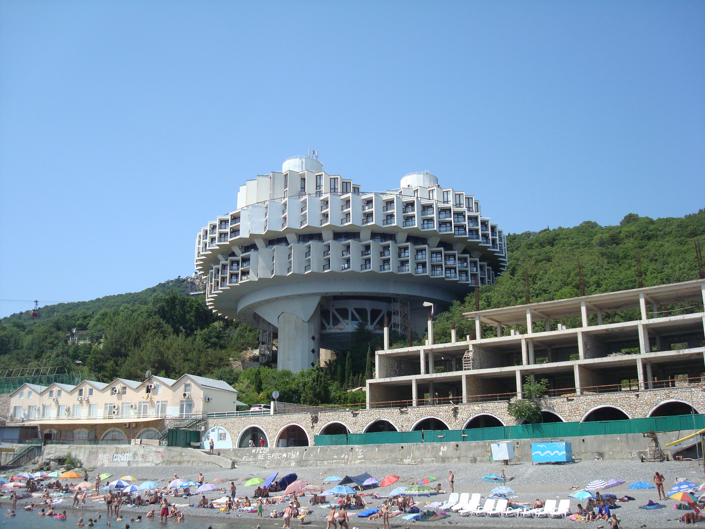

# 1. Introduction to the Book

  
  
Sanatorium Kurpaty

The purpose of this book is to provide the reader with a methodology to solve multi-stakeholder engineering design problems. The design process is modeled using a mathematical optimization model because of the isomorphisms [^isomorphisms] between design and mathematical optimization problems. Although mathematical optimization is being used to solve such problems, classical approaches are problematic for two main reasons:
1. The scales used for rating candidate design solutions on preference do not enable fundamental mathematical operations.
2. The commonly used weighted arithmetic mean algorithm for aggregating ratings and weights yields an infinite amount of outcomes.

Engineering design commonly relies on modeling and simulation, the basics of both are described in {ref}`<chapter_3>`. Because of the isomorphisms between (engineering design), mathematical optimization, systems thinking and decision making all of these are formally defined in Chapters 3 to 6 respectively. This then leads to the formal description of the preference-based engineering design methodology which is described in  {ref}`<chapter_7>`.

A number of Preference-based Engineering Design applications are then used in  {ref}`chapter_9` to illustrate how the methodology can be applied to real life (engineering) design problems. We end the book in  {ref}`<chapter_10>` with a reflection on the methodology itself and its broader use and implications.

[^isomorphisms]: An isomorphism is a one-to-one correspondence between two structures, such that the relationships and operations defined on one structure are preserved in the other. In design and mathematical optimization, this means that a design problem can be mapped to an optimization problem in a way that preserves the problem's essential characteristics and constraints.
