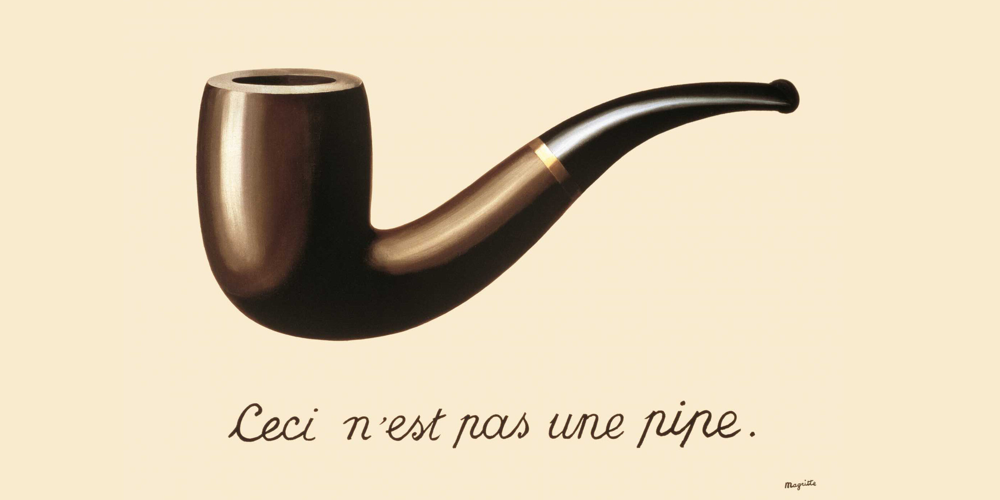

# 3.1. Modeling

  
  
'The Treachery of Images' by René Magritte

The painting above shows an image of a pipe painted by Magritte. Below it, Magritte painted, "Ceci n'est pas une pipe", French for "This is not a pipe".

> The famous pipe. How people reproached me for it! And yet, could you stuff my pipe? No, it's just a representation, is it not? So if I had written on my picture "This is a pipe", I'd have been lying!

- <cite>René Magritte<cite>

## Model definition

A model is an informative representation of an object, person or system. The term originally denoted the plans of a building in late 16th-century English, and derived via French and Italian ultimately from Latin modulus, a measure.

Models can be divided into physical models (e.g. a model airplane) and abstract models (e.g. mathematical expressions describing behavioral patterns).
A model is an abstraction of reality or a representation of a real object or situation. In other words, a model presents a simplified version of something. It may be as simple as a drawing of a house plan, or as complicated as a miniature but functional representation of a complex piece of machinery. A model airplane may be assembled and glued together from a kit by a child, or it actually may contain an engine and a rotating propeller that allows it to fly like a real airplane.

A more useable concept of a model is that of an abstraction, from the real problem, of key variables and relationships. These are abstracted in order to simplify the problem itself. Modeling allows the user to better understand the problem and presents a means for manipulating the situation in order to analyze the results of various inputs ('what if' analysis) by subjecting it to a changing set of assumptions.

## Model classification

Some models are replicas of the physical properties (relative shape, form, and weight) of the object they represent. Others are physical models but do not have the same physical appearance as the object of their representation. A third type of model deals with symbols and numerical relationships and expressions. Each of these fits within an overall classification of four main categories:

* Physical models
* Schematic models
* Verbal models
* Mathematical models

### Physical models

Physical models are the ones that look like the finished object they represent. Iconic models are exact or extremely similar replicas of the object being modeled. Model airplanes, cars, ships, and even models of comic book super-heroes look exactly like their counterpart but in a much smaller scale. Scale models of municipal buildings, shopping centers, and property developments such as subdivisions, homes, and office complexes all hopefully look exactly as the "real thing" will look when it is built. The advantage here is the models' correspondence with the reality of appearance. In other words, the model user can tell exactly what the proposed object will look like, in three dimensions, before making a major investment.

In addition to looking like the object they represent, some models perform as their counterparts would. This allows experiments to be conducted on the model to see how it might perform under actual operating conditions. Scale models of airplanes can be tested in wind tunnels to determine aerodynamic properties and the effects of air turbulence on their outer surfaces. Model automobiles can be exposed to similar tests to evaluate how wind resistance affects such variables as handling and gas mileage. Models of bridges and dams can be subjected to multiple levels of stress from wind, heat, cold, and other sources in order to test such variables as endurance and safety. A scale model that behaves in a manner that is similar to the "real thing" is far less expensive to create and test than its actual counterpart. These types of models often are referred to as prototypes.

Additionally, some physical models may not look exactly like their object of representation but are close enough to provide some utility. Many modern art statues represent some object of reality, but are so different that many people cannot clearly distinguish the object they represent. These are known as analog models. An example is the use of cardboard cutouts to represent the machinery being utilized within a manufacturing facility. This allows planners to move the shapes around enough to determine an optimal plant layout.

### Schematic models

Schematic models are more abstract than physical models. While they do have some visual correspondence with reality, they look much less like the physical reality they represent. Graphs and charts are schematic models that provide pictorial representations of mathematical relationships. Plotting a line on a graph indicates a mathematical linear relationship between two variables. Two such lines can meet at one exact location on a graph to indicate the break-even point, for instance. Pie charts, bar charts, and histograms can all model some real situation, but really bear no physical resemblance to anything.

Diagrams, drawings, and blueprints also are versions of schematic models. These are pictorial representations of conceptual relationships. This means that the model depicts a concept such as chronology or sequence. A flow chart describing a computer program is a good example. The precedence diagrams used in project management or in assembly-line balancing show the sequence of activities that must be maintained in order to achieve a desired result.

### Verbal models

Verbal models use words to represent some object or situation that exists, or could exist, in reality. Verbal models may range from a simple word presentation of scenery described in a book to a complex business decision problem (described in words and numbers). A firm's mission statement is a model of its beliefs about what business it is in and sets the stage for the firm's determination of goals and objectives.

Verbal models frequently provide the scenario necessary to indicate that a problem is present and provide all the relevant and necessary information to solve the problem, make recommendations, or at least determine feasible alternatives. Even the cases presented in management textbooks are really verbal models that represent the workings of a business without having to take the student to the firm's actual premises. Oftentimes, these verbal models provide enough information to later depict this problem in mathematical form. In other words, verbal models frequently are converted into mathematical models so that an optimal, or at least functional, solution may be found utilizing some mathematical technique. A look in any mathematics book, operations management book, or management science text generally provides some problems that appear in word form. The job of the student is to convert the word problem into a mathematical problem and seek a solution.

### Mathematical models

Mathematical models are perhaps the most abstract of the four classifications. These models do not look like their real-life counterparts at all. Mathematical models are built using numbers and symbols that can be transformed into functions, equations, and formulas. They also can be used to build much more complex models such as matrices or linear programming models. The user can then solve the mathematical model (seek an optimal solution) by utilizing simple techniques such as multiplication and addition or more complex techniques such as matrix algebra or Gaussian elimination. Since mathematical models frequently are easy to manipulate, they are appropriate for use with calculators and computer programs. Mathematical models can be classified according to use (description or optimization), degree of randomness (deterministic and stochastic), and degree of specificity (specific or general). Following is a more detailed discussion of mathematical model types.

**Descriptive models** are used to merely describe something mathematically. Common statistical models in this category include the mean, median, mode, range, and standard deviation. Consequently, these phrases are called 'descriptive statistics.' Balance sheets, income statements, and financial ratios also are descriptive in nature.

**Optimization models** are used to find an optimal solution. Linear programming models, for instance, are mathematical representations of constrained optimization problems. These models share certain common characteristics. Knowledge of these characteristics enables us to recognize problems that can be solved using linear programming.

**Deterministic models** are those for which the value of their variables is known with certainty. In a previous example, the manager knew profit margins and constraint values with certainty. This makes the linear programming model a deterministic optimization model.

**Stochastic** or probabilistic models have values that are not known with certainty. For example, a manufacturer that is having trouble deciding whether to build a large or small facility knows that the solution to this capacity problem depends upon the volume of demand that materializes. High demand would require a large facility while low demand would require a small facility. While the manufacturer has no way of knowing with certainty what demand will be, it can at least determine the probability of the occurrence of each. For example, if the manufacturer estimates that the probability of the occurrence of high demand is 70 percent and the occurrence of low demand is 30 percent, it can use this information along with the monetary value (expected payoff) of each situation to construct mathematical models such as payoff matrices or decision trees to find an optimal decision. 
