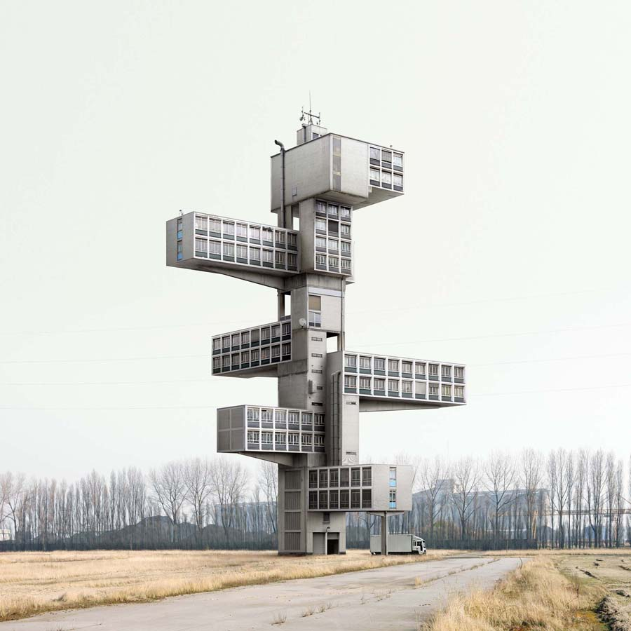

# 4. Engineering design fundamentals

  

To design is to imagine and specify things that do not exist, usually with the aim of bringing them into the world. The “**things**” may be tangible – machines, buildings and bridges; they may be procedures – the plans for a marketing scheme, an organization or a manufacturing process.

<!--more-->

Virtually every professional activity has a large component of design, although usually combined with the tasks of bringing the designed things into the real world.

> A design is a concept of either an object, a process, or a system that is specific and, in most cases, detailed. Design refers to something that is or has been intentionally created by a thinking agent, though it is sometimes used to refer to the nature of something.
