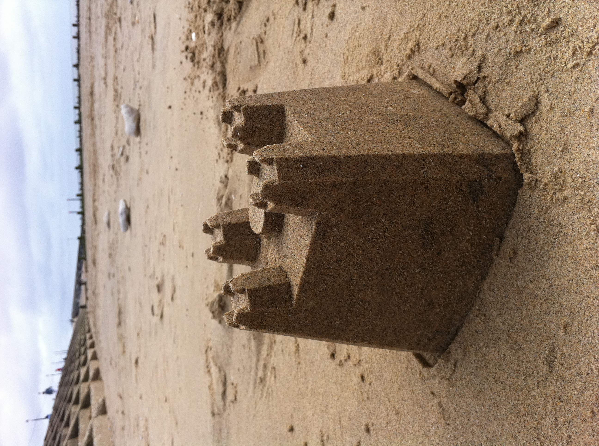
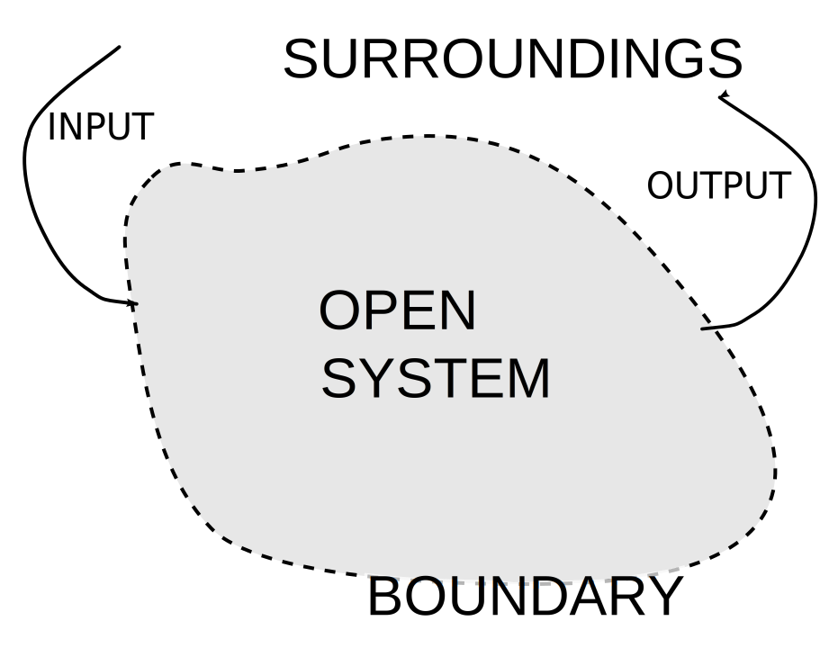

# 6.1. Formal Definition

> A system is a group of interacting or interrelated elements that act according to a set of rules to form a unified whole.[1] A system, surrounded and influenced by its environment, is described by its boundaries, structure and purpose and is expressed in its functioning. 

- <cite>Wikipedia<cite>

The term system comes from the Latin word systēma, in turn from Greek σύστημα systēma: "whole concept made of several parts or members, system", literary "composition". 

A system, according to Ackoff [^1] is a set of two or more elements that satisfies the following three conditions:

1. **The behavior of each element has an effect on the behavior of the whole.** Consider for example that system which is, perhaps, the most familiar to us: thu human body. Each of its parts - the heart, lungs, stomach, and so on - has an effect on the performance of the whole. However, one part of the body, the appendix, is not known to have any such effect. It is not surprising, therefore, that it is called the appendix which means 'attached to,' not 'a part of.' If a function is found for the appendix, its name would probably be changed.
2. **The behavior of the elements and their effects on the whole are interdependent.** This condition implies that the way each element behaves and the way it affects the whole depends on how at least one other element behaves. No element has an independent effect on the system as a whole. In the human body, for example, the way the heart behaves and the way it affects the body as a whole depends on the behavior of the brain, lungs, and other parts of the body. The same is true for the brain and lungs.
3. **However subgroups of the elements are formed, each has an effect on the behavior of the whole and none has an independent effect on it.** To put it another way, the elements of a system are so connected that independent subgroups of them cannot be formed.

## Emergence

A system is therefore a whole that cannot be divided into independent parts. From this, two of its most important properties derive: every part of a system has properties that it loses when separated from the system, and every system has some properties - its essential ones - that none of its parts do. This is called emergence. An organ or part of the body, for example, if removed from the body does not continue to operate as it did before removal. The eye detached from the body cannot see. On the other hand, people can run, play piano, read, write, and do many other things that none of their parts can do by themselves. No part of a human being is human; only the whole is.

## System states

The state of a system is defined by specifying values of a set of properties sufficient to determine all other properties. For fluid systems, typical properties are pressure, volume and temperature. A system has an unlimited number of properties but not all relate to a social system's purpose.

## Entropy

Entropy is the measure of the disorder of a system. An ordered system has low entropy, while a disordered system has high entropy. Physicists often state the definition differently, where entropy is the energy of a closed system that is unavailable to do work.

Note the difference between open and closed systems. In the natural sciences an open system is one whose border is permeable to both energy and mass. By contrast, a closed system is permeable to energy but not to matter.

Physicists and cosmologists often call entropy "the arrow of time" because matter in isolated systems tends to move from order to disorder. Over time, ordered systems become more disordered and energy changes forms, ultimately getting lost as heat.

Take a sandcastle that has low entropy directly after its creation but will over time turn into a disordered system having high entropy. 

  

The total entropy of a closed system cannot decrease. For example, a scattered pile of papers never spontaneously orders itself into a neat stack. The heat, gases, and ash of a campfire never spontaneously re-assemble into wood.

However, the entropy of one system can decrease by raising entropy of another system. For example, freezing liquid water into ice decreases the entropy of the water, but the entropy of the surroundings increase as the phase change releases energy as heat. When the entropy of the system being studied decreases, the entropy of the environment increases.

This principle applies to human action when we change the material world and bring order to the natural system. Adhering to the principles of entropy, as soon as the new artifact has been created entropy will occur resulting in the artefact to revert back to a state of higher entropy. This explains why the steel of a newly built car has a natural tendency to revert to iron ore over time.

## System boundary

Open systems have input and output flows, representing exchanges of matter, energy or information with its surroundings. It is important do determine a system's boundary when considering a system. Recall that there is likely a hierarchy of systems where a number of systems can be part of a containing system. Focusing on a system also requires considering the system that the system itself is part of.

  

[^1]: Ackoff
