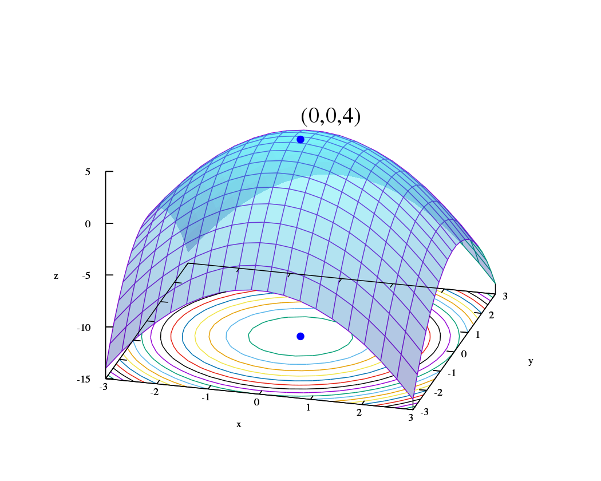

# 7. Optimization fundamentals

Mathematical optimization is the selection of a best element, with regard to some criterion, from some set of available alternatives. It is generally divided into two subfields: **discrete** optimization and **continuous** optimization. It can also be divided into **constrained** and **unconstrained** optimization or **linear** and **non-linear** optimization.

  
  
Graph of a surface given by \( z = f(x, y) = -(x^2 + y^2) + 4 \). The global maximum at \( (x, y, z) = (0, 0, 4) \) is indicated by a blue dot.

