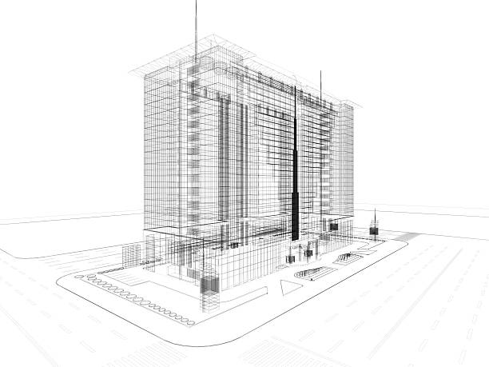

# 8. Preference-based Engineering design methodology

This chapter describes the Preference-based Design methodology for solving engineering design problems using mathematical modeling and optimization. Before introducing the methodology itself, we introduce a generic problem conceptualization as proposed by Ackoff[^1]. We then show how Dym[^2] conceptualizes problems in the domain of engineering design. These two combined lead to a generic conceptualization of PBED problems.

[^1]: Ackoff, R. L. (1999). Ackoff's best: His classic writings on management. (No Title).
[^2]: Dym, Clive L. Engineering design: A project-based introduction. John Wiley & Sons, 2004.
