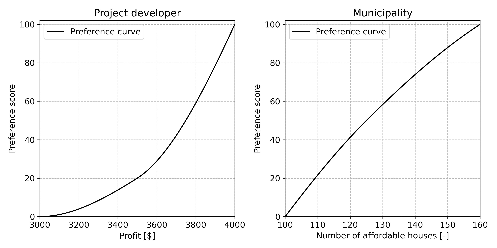
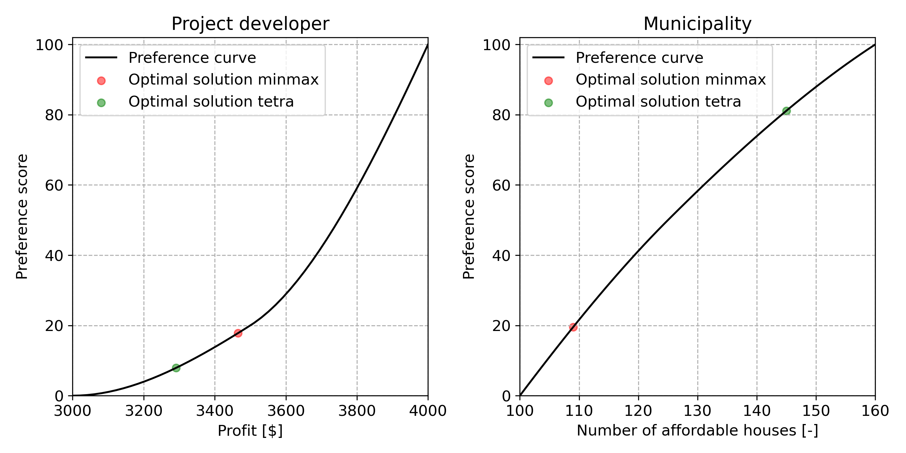

# 8.7. The urban planning multi-stakeholder problem

A municipality is facing a housing shortage concerning mainly low income household types (qualitative problem statement). It has acquired a plot of land that can be developed for low income housing purposes (qualitative goal statement). It has come into contact with a project developer interested in developing the plot of land (qualitative goal statement).  The municipality wants to make sure that different types of households are able to acquire houses and defined four types of houses (design variables). The types of houses differ mainly in the selling price, ranging from affordable to expensive houses. The municipality wants the area to be as much accessible to low income households as possible and therefeore wants to maximize the number of affordable houses type A and D (quantitative goal statement) and has limited the total number of houses to between 200 and 260 (constraints). The project developer is mainly interested in making a profit and wants to maximize the total fee (operationalized goal). The selling prices have been established, as has the developer’s fee for each type of house. All data is summarized in the table below.

Within the decision making process both parties agree that they have equal power.

| Type | Selling price  | Developer's fee |
| ---- | -------------- | --------------- |
| A    | 225,000        | 11,250          |
| B    | 275,000        | 13,750          |
| C    | 300,000        | 15,000          |
| D    | 225,000        | 11,250          |

- **Step 1: Specify the design variables**

The design variables $x_1 \ldots x_4$ are the number of houses built of each type A-D.

- **Step 2: Retrieve decision maker's objectives**

The project developer is interested in maximizing profit $O_1$ whereas the municipality is interested in maximizing the number of affordable houses $O_2$ (the sum of houses type A and D). 

- **Step 3: Determine the preference functions for each objective**

The project developer rates a synthetic design alternative yielding a profit of ＄$3M$ at $0$, a synthetic alternative yielding a profit of ＄$3.5M$ at $20$ and a synthetic alternative yielding a profit of ＄$4M$ at $100$.

The municipality rates a synthetic design alternative having $100$ affordable houses at $0$, a synthetic alternative having $125$ houses at $50$ and a synthetic alternative having $160$ houses at $100$.

  
  
Urban Planning Problem Functions

- **Step 4: To each objective assign decision maker's weights**

For this problem the weights are assumed to be equal, i.e. $w_1 = w_2 = 0.5$.

- **Step 5: Determine the design constraints**

The design constraints relate to the total number of houses, and the objective values where the preference functions cross the x-axis. In other words, values for the objectives that relate to preference ratings lower than zero are not allowed.

$$x_1 + x_2 + x_3 + x_4 \geq 200$$

$$x_1 + x_2 + x_3 + x_4 \leq 260$$

- **Step 6: Find the optimal design having the highest preference score**

Running the optimization yields a local [^3] optimal design configuration where $112$ houses type A, $52$ type B, $63$ type C and $33$ type D are built. This design configuration yields a profit of &#65284;$3.3M$ and $145$ affordable houses and is shown in the below figure.

  
  
Urban Planning Problem Result

[^3]: The nature of non-linear optimization is such that, if the problem's feasible set is non-empty, it can only find a so-called local optimum. As a result, it may be that, depending on the start point of the search, your optimization run finds a different optimal solution than presented here. This is drawback of non-linear optimization.
