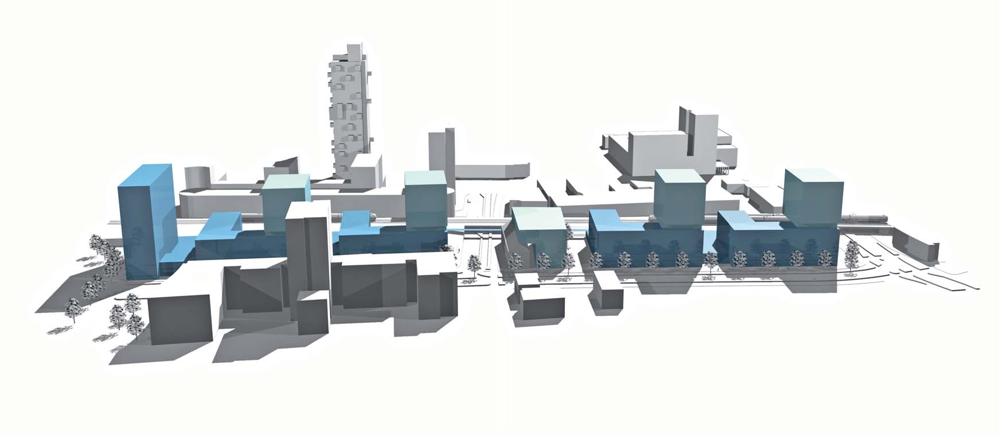
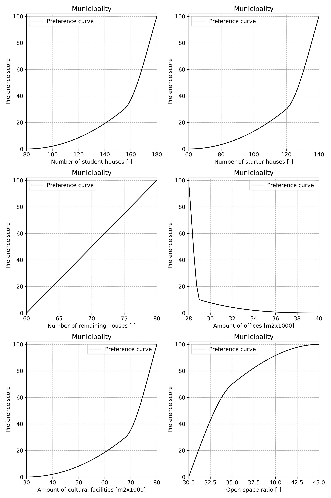
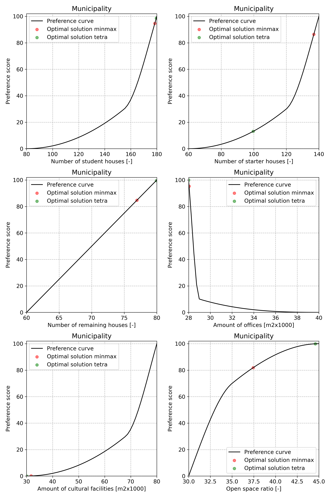

# 9.1. The Tilburg area development case

Tilburg is one of the larger cities within the province of Noord Brabant, the Netherlands, and serves as a public transport hub connecting some major cities within the province: Breda, Den Bosch and Eindhoven. The railway zone running through Tilburg acts as a barrier between the city center to the South and the residential areas to the North (qualitative problem statement) and plans are being developed to solve this problem. An example of such a plan is shown in the figure below.

The idea is that by developing a mix of different functions within the railway zone the barrier is removed so that the center is connected to the northerly residential areas. The question then arises: What mix of functions is both feasible and most desirable?

Whereas the desirability aspect is determined by the municipality’s wishes with respect to what amount of what function is most desirable, the feasibility aspect is determined by the actual plot size and density indicators, i.e. Floor Space Index (FSI), Ground Space Index (GSI), and Open-Space Ratio (OSR) [^OSR].

The municipality wants the area to be livable (qualitative goal statement) and therefore has defined that a mix of the following functions should be maximized (design variables but also operationalized goals):

* Student houses
* Starter houses
* Remaining houses
* Cultural facilities

Furthermore, in order to make the area livable it want to minimize the amount of offices (design variable but also operationalized goal). Finally, also related to making the area livable, it wants the open space ratio to be maximized (operationalized goal).

The open space requirement of a given design configuration has to within the size of the area, i.e. the amount of available land (constraint). The amount of open space per house type also has to be within the size of the area (constraint). The municipality has contracted an urban planner to determine the exact coefficients to be used for each function and house type.

Within the decision making process all goals are given the same weight. Note that this is a single decision maker problem.

  

## Step 1: Specify the design variables

The municipality’s urban design department is interested in the composition of the new area. The design department defines the composition by allowed lower and upper decision variable values for each function; the amount of square meters floor space for three types of houses $h_1 , h_2 , h_3$, offices $o$, cultural facilities $c$ and the percentage open space $s$.

## Step 2: Retrieve decision maker's objectives

In this case there is a one-to-one relationship between design variables and objectives.

## Step 3:Specify the preference functions for each objective

* The municipality rates a synthetic design alternative having 80 student houses at 0, a synthetic alternative having 155 at 30 and a synthetic alternative having 180 student houses at 100.

* The municipality rates a synthetic design alternative having 60 starter houses at 0, a synthetic alternative having 120 starter houses at 30 and a synthetic alternative having 140 starter houses at 100.

* The municipality rates a synthetic design alternative having 60 remaining houses at 0, a synthetic alternative having 70 remaining houses at 50 and a synthetic alternative having 80 remaining houses at 100.

* The municipality rates a synthetic design alternative having 28k square meters office space at 100, a synthetic alternative having 29k square meters office space at 10 and a synthetic alternative having 40k square meters office space at 0.

* The municipality rates a synthetic design alternative having 30k square meters facilities at 0, a synthetic alternative having 68k square meters facilities at 30 and a synthetic alternative having 80k square meters facilities at 100.

* The municipality rates a synthetic design alternative having an open space ratio of 0.30 at 0, a synthetic alternative having an open space ratio of 0.35 at 70 and a synthetic alternative having an open space ratio of 0.45 at 100.

  

### Step 4: To each objective assign decision maker's weights

For this problem the weights are assumed to be equal, i.e. $w_1 \ldots w_6 = \frac{1}{6}$.

### Step 5: Determine the design constraints

For this case two design constraints are used. The first relates the floor space of each function and the required open space to the
available amount of land:

$$
0.1 (100 h_1) + 0.17 (80 h_2) + 0.2 (120 h_3) + 0.1 o 
+ 0.25 (40 h_1 + 35 h_2 + 28 h_3) 
+ 0.33 c + 100500 s 
+ 40 h_1 + 40 h_2 + 28 h_3 
+ 0.3 (o + (40 h_1 + 35 h_2 + 28 h_3) + c ) 
\leq 100500
$$

The second relates the required amount of open space per house to the available amount of open space:

$$85 h_1 + 85 h_2 + 75 h_3 \leq 100500 s$$

### Step 6: Find the optimal design having the highest preference score

Running the optimization yields a local [^1] optimal design configuration having 178 student houses, 100 starter houses, 80 remaining houses, 20 000 square meters offices, 30 000 square meters cultural facilities having an open space ratio of 0.445 and is shown in the below figure.

  

[^1]: The nature of non-linear optimization is such that, if the problem’s feasible set is non-empty, it can only find a so-called local optimum. As a result, it may be that, depending on the start point of the search, your optimization run finds a different optimal solution than presented here. This is a drawback of non-linear optimization.

[^OSR]: OSR in Urban Planning sets benchmarks for urban development. Establishing minimum OSR requirements in urban planning regulations ensures that developers allocate sufficient open spaces. This helps create a balance between built-up areas and green spaces, preventing overcrowding and maintaining a healthy urban environment.
OSR also plays a crucial role in ensuring equitable access to open spaces for all residents, regardless of socio-economic background. Planning policies that mandate OSR take into account factors such as population density and proximity to open spaces, ensuring that communities have fair and adequate access to recreational areas.
By integrating OSR into urban planning, cities can promote sustainability and resilience. Open spaces can be designed to incorporate green infrastructure, such as rain gardens and urban forests, facilitating water management, reducing energy consumption, and promoting ecological balance. A higher OSR contributes to healthier communities by providing opportunities for physical activity, reducing sedentary lifestyles, and improving air quality. Accessible open spaces promote active living and contribute to the prevention of chronic diseases, such as obesity and cardiovascular conditions [^2].

[^2]: preliminaryzoninganalysis.com