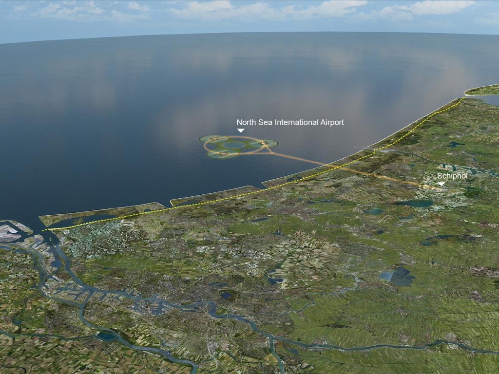
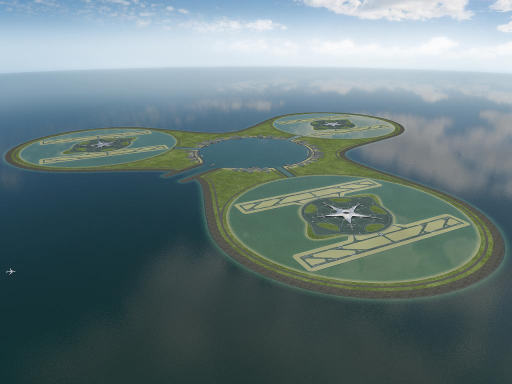
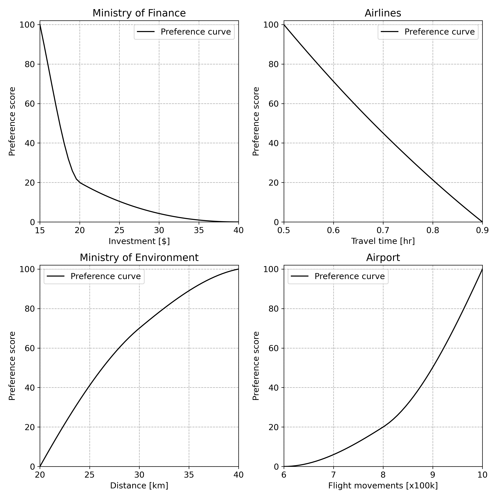
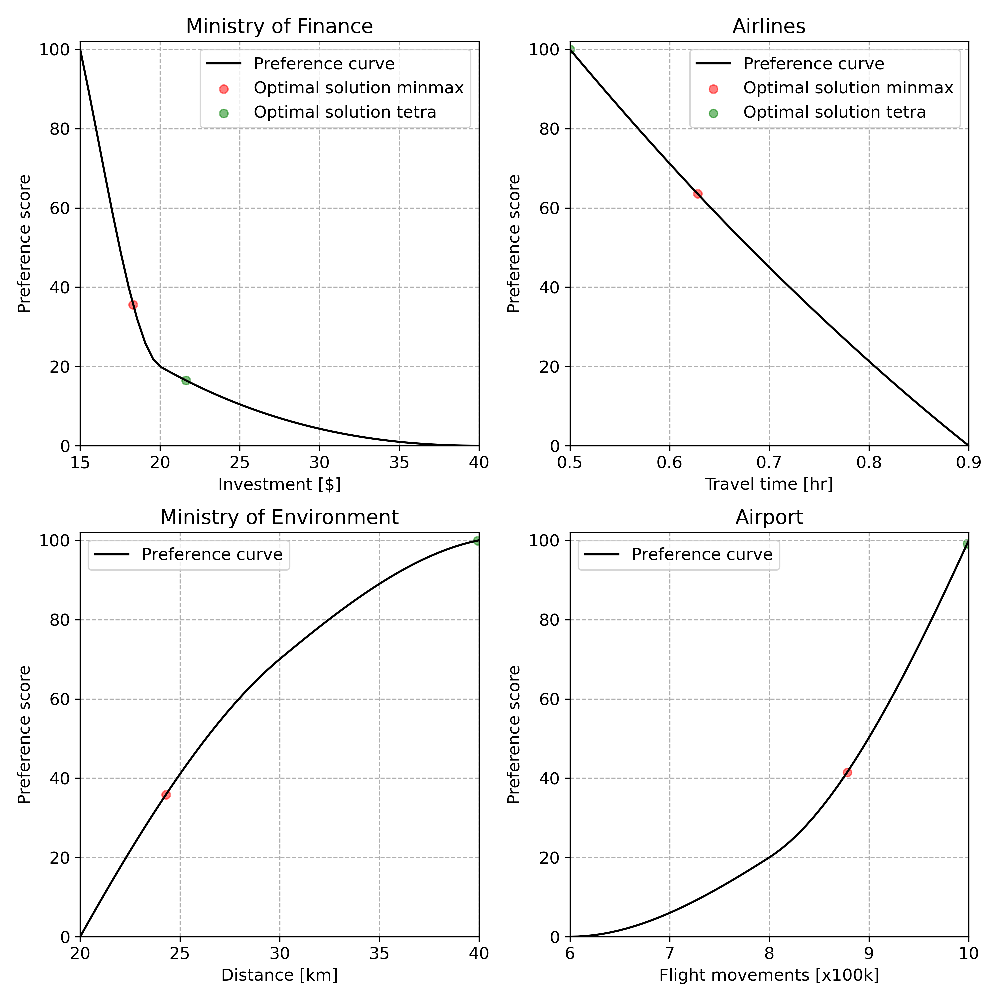

# 9.2. The North Sea island case

The dilemma for Schiphol is the following [van Gunsteren, 2005]:

* To maintain its position as a main port, the number of flight movements per year should be above a certain threshold.
* To keep the environmental effects within acceptable limits, in particular noise hindrance but also air pollution, the number of flight movements should be kept below a certain level.

This dilemma could be resolved by the North Sea Island option: moving the take-off and landing of airplanes to an artificial island in the North Sea which is connected by a train shuttle to the present airport. Preliminary studies of such an artificial island by Royal Haskoning & Van Oord are shown in the figures below.

  

  

Van Gunsteren solved this problem using the **constraint method** within Open Design methodology. As discussed in Chapter 5, this process has significant arbitrary elements in the sense that its final solution relies on unstructured negotiation.

### Step 1: Specify the design variables

The following decision makers are identified along with the decision variables they are interested in:

* The Ministry of Finance is interested in the investment (decision variable $i$ in billion dollars).
* The airlines are interested in the time (decision variable $t$ in hours) passengers would have to spend in the shuttle.
* The Ministry of Environment is interested in the distance (decision variable $d$ in kilometers) between the island and the shore.
* The airport is interested in the number of flight movements (decision variable $f$ in 100k flight movements).

### Step 2: Retrieve decision maker's objectives

In this case there is a one-to-one relationship between design variables and objectives.

### Step 3: Specify the preference functions for each objective

* The Ministry of Finance rates a synthetic alternative that would cost 15 billion dollars at 100 and an alternative that would cost 40 billion dollars at 0. A third alternative costing 20 billion dollars is rated at 20.

* The airlines rate a synthetic alternative that requires passengers to spend 0.5 hours in the shuttle at 100 and an alternative that requires them to spend 0.9 hours at 0. A third alternative that would require them to spend 0.7 hours is rated at 45.

* The Ministry of Environment rates a synthetic alternative that has a distance of 40 kilometers between the island and the shore at 100 and an alternative that has a distance of 20 kilometers at 0. A third alternative that has a distance of 30 kilometers is rated at 70.

* The airport rates a synthetic alternative with 10 × 100k flight movements at 100 and an alternative with 6 × 100k flight movements at 0. A third alternative with 8 × 100k flight movements is rated at 20.

The resulting preference functions are shown in the figure below.

  

### Step 4: To each objective assign decision maker's weights

For this problem the weights are assumed to be equal, i.e. $w_1 \ldots w_4 = 0.25$.

### Step 5: Determine the design constraints

For this experiment two design constraints were used. The first relates the distance between the island and the shore (decision variable $d$ in kilometers) and the time passengers have to spend in the shuttle (decision variable $t$ in hours) using a postulated shuttle speed of 120 kilometers per hour:

$$\frac{d}{120} \leq t$$

The second design constraint relates the number of flight movements (decision variable $f$ in 100k flight movements), the distance between the island and the shore (decision variable $d$ in kilometers) and the investment (decision variable $i$ in billion dollars). Given that building an island for 600k flight movements at a distance of 10 kilometer from the shore would cost 15 billion dollars, the investment increases with 0.15 billion dollars per 100k flight movements more than 600k and increases with 0.2 billion dollars per kilometer more distance from the shore than 10 kilometers:

$$15 + 0.15(f - 6) + 0.2(d - 10) \leq i$$

### Step 6: Find the optimal design having the highest preference score

Running the optimization yields a local [^1] optimal design configuration costing 21.64 billion dollars, requiring passengers to spend half an hour in the shuttle where the island is at a distance of 40 kilometers from the shore and accommodates 10 x 100k flight movements and is shown in the below figure.

  

